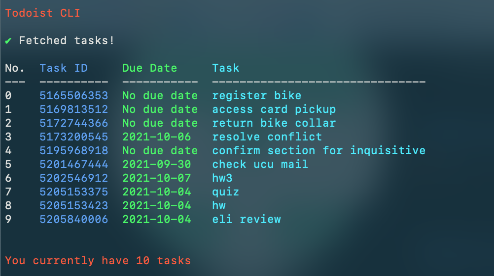

# doer
A CLI program for Todoist, a productivity todo list app.

To use doer with your own Todoist account, create a config.js file and include the following code.
```
module.exports = config = {
	key: "YOUR_TODOIST_API_KEY",
}
```
